---
output:
  word_document:
    fig_caption: yes
    keep_md: yes
    toc: yes
    reference_docx: Style/mystyles.docx
df_print: kable
--- 


---
title: 罗氏沼虾*Macrobrachium rosenbergii*育种核心群体2018G02世代遗传评估报告（No.SFMR20180325）
author: 受托单位：江苏数丰水产种业有限公司 评估人：栾生、夏正龙、隋娟、孔杰、杨国梁
date: 2020-07-06
---

#####
# 一、育种材料和方法  

## 1.1 育种目标性状

育种目标是指在罗氏沼虾育种计划中，将要进行遗传改良的性状。育种目标性状一般符合以下3个条件：1）.必须是利用现有的仪器可测量的；2）.获取性状数据的测量成本应当较低；3）.性状在遗传上表现为加性效应。从理论上来说，育种目标应包括所有重要的经济性状。借鉴其他物种的育种经验，根据罗氏沼虾的实际育种需求，选择收获体重和存活2个性状作为目标性状。

## 1.2 基础群体

基础群体遗传变异的丰富度，决定着罗氏沼虾育种计划是否能够成功。罗氏沼虾作为一个引进种，国内种质资源缺乏。限于现有条件，本育种计划的奠基者群体为：
2015年引入：MP-2014年家系混合群体；DP-2015年扩繁群体；MN-缅甸群体；BD-孟加拉群体；T1-泰国正大群体

2016年引入：T2-泰国正大群体。

## 1.3 家系生产

单独建立家系，一方面是为了记录个体的系谱，另外有许多重要的性状，譬如存活率和抗病性等，不能在候选亲本上进行测试，但是可以通过收集家系中的同胞个体的测试数据来间接进行评估。为保证罗氏沼虾育种计划的可持续性，每个世代构建全同胞家系应不少于150个。

2018年通过脱卵消毒，共构建家系142个；从第一个家系变苗（2018.3.25）到最后一个（2018.4.24）相差30天。淘汰暂养期存活率较低家系，保留129个家系。2018年6月25日开始打标记下塘养殖，每个家系挑选300尾个体大的虾进行标记，平均分在两个测试土池（P10、P11）养殖。2018年养殖测试密度提高到了每平方米9尾以上。

### 1.3.1	亲虾越冬

从上一年10月起捕核心群体至第二年2月配种前，亲虾需要在温室经过4-5个月的越冬期管理。越冬期间，一方面需要尽可能保证亲虾的越冬成活率以减少优良亲虾的损失，另一方面需要保证亲虾越冬期的营养需求，从而增强亲虾的体质，确保受精卵的质量和数量；保持亲虾养殖的水质稳定，促进雌虾性腺同步发育，从而缩短家系间由于育苗时间不同引起的误差。

### 1.3.2	亲虾交配

配种亲虾源自上一年体重育种值排序靠前的家系；待搭配个体间的亲缘关系设置为亲缘系数上限制；家系内选择高育种值个体，家系间随机搭配；每个家系贡献同等入选个体数量，一般不超过3尾；雌雄性别比例为4：1，雌虾均来自不同家系。配种流程为从个体网箱内取虾，核对颜色及雌雄，按交配组号集中暂养，消毒，入配种池。备份雄虾转移至新的个体网箱内养殖，重新记录个体编号。实验表明使用小型水泥池（3平方米）作为罗氏沼虾配种池，可以促进亲虾性腺发育，提高亲虾产卵同步性，减少雌虾脱卵率及亲虾死亡率。

### 1.3.3	家系构建与幼体培育

2018年构建的所有家系都经过脱卵消毒。配种后定期检查每个交配池抱卵虾情况，发现虾卵颜色变灰，把灰卵虾抓出，单独放入含5‰胰蛋白酶溶液的小桶中，浸泡约10分钟后，抓住虾头胸甲部分，在胰蛋白酶溶液中来回甩动，使卵散落在溶液中。待虾腹部卵粒全部脱落后，用60目的纱绢网将卵粒收集，并用清水冲洗，将卵上的胰蛋白酶冲洗干净，然后连同纱绢网把卵粒浸没在75%的酒精中消毒25秒；然后再用清水冲洗卵粒，最后把所有卵粒放入预先加有盐度7‰半咸水的120L白桶内，爆气孵化。

每天早上检查孵化桶的孵化情况，发现幼体即用60目的纱绢网将幼体移出，计数2000尾（第1次数量标准化）放入已预先加入50L盐度为14‰半咸水的白桶内进行培育，剩余幼体移入扩繁培育池。前一周投喂5个/ml密度的卤虫无节幼体，第8天左右开始增加投喂人工制作的蛋羹。当80%以上幼体变态成仔虾时，分二次将海水盐度淡化至3‰以内。淡化后第2天上午，用60目纱绢网将仔虾捞出。计数600尾（第2次数量标准化）移入家系虾苗暂养车间的3平方米的暂养池内进行中间培育。

### 1.3.4	家系幼体中间培育

仔虾淡化后的第2天，每个家系随机准确计数600尾活力强的仔虾分别放入3平方米的水泥池中养殖，经过30天左右的养殖，仔虾可生长至体长2.5cm，达到标记规格。仔虾培育期间投喂虾片及罗氏沼虾配合饲料。

### 1.3.5	病原检测

为确保所有家系不带特定的几种病原，对每个家系脱卵消毒后的卵粒、培育期间的幼体和第二次数量标准化前的仔虾分别取样检测，检测阴沟肠杆菌、柠檬酸杆菌、嗜水气单胞菌、产气肠杆菌、诺达病毒、诺谛病毒和双顺反子病毒等病源，淘汰检测呈阳性的家系。

## 1.4 家系和个体标记

将所有家系的测试个体，放入相同的环境中测试，能够降低环境效应，增加育种值估计的准确度。因此，需要对家系测试个体进行标记。此外，为了追踪测试个体和候选育种亲本的系谱，也需要对个体进行标记。本育种计划采用VIE荧光染料和箱笼法对罗氏沼虾进行家系和个体标记。

### 1.4.1	家系标记

应用“可视嵌入性橡胶标志” (visible implant elastomer, VIE)作为家系标记方法，标记材料选用美国NMT公司生产5种荧光颜料（粉、红、橙、黄、绿）和一种非荧光染料（蓝）。在仔虾的第6腹节处选取4个部位中的2个位置进行VIE注射，每个家系用不同的颜色组合进行标记。

### 1.4.2	个体标记

虾类的个体标记目前常用的是眼标（eye tag）。如在中国对虾上，用眼标进行个体标记非常理想，但在罗氏沼虾上，因其眼柄粗短且呈锥形，用眼标标记时，眼标容易脱落。本育种计划采用“个体编号箱笼养殖方法”标记罗氏沼虾候选育种亲本。采用网箱做成的笼格（简称箱笼），单独养殖罗氏沼虾个体，并在箱笼上方挂一有编码的个体标签，以示区分不同个体，有多少个体就做多少箱笼，其个体的标记率和可读率均为100%。经120天的箱笼养殖，其成活率达91.5%。

## 1.5 目标性状测试
2018年6月25日开始对129个家系进行标记VIE，每个家系挑选300尾，测量平均体重，平分在两个养殖测试塘，每个家系每个池塘放养150尾虾，总放苗密度约为每平方米9-10尾虾。10月2日开始起捕，两个塘中的虾全部移入温室暂养。对129个家系的所有个体进行标记颜色读取、体长、体重等性状测量，超过平均体重，且健康完整的个体装入笼子并编号。
2018年罗氏沼虾在2个池塘中测试，面积分别为：P10-2133 平方米; P11-2000 平方米。相比于2017年，2018年测试成活率大幅度提高，62%-68%之间。具体养殖管理信息见下表。

## 1.6 遗传参数和育种值预测


遗传参数（遗传力和遗传相关等）是评估育种目标性状是否具有选择潜力，制定合适的选择策略以及估计育种值等工作必须的基础参数。在罗氏沼虾育种计划中，追踪并建立个体的系谱资料信息，充分利用个体所有的亲缘关系和性能资料；针对生长性状，选择个体动物模型，针对存活性状，选择阈值模型，考虑世代、性别、池塘号、家系等固定和随机因素，建立育种目标性状的混合模型方程；利用REML方法迭代计算选择性状的表型方差、遗传方差、遗传协方差等方差组分，估计性状的遗传参数如遗传力，性状间的遗传相关等，建立遗传参数精确评估模型。

利用ssGBLUP（single step Best linear unbiased prediction）方法估计生长和存活性状的育种值。ssGBLUP方法能够结合亲本的高通量SNP数据校正育种核心群个体间的亲缘关系，同时综合利用各类亲属的测定成绩来综合估计个体育种值，从而明显提高选择的准确度，特别是对于存活率等低遗传力性状，效果更为明显。收获体重育种值估计模型主要包括世代、性别、测试池塘等固定效应，个体加性遗传效应和共同环境效应2个随机效应。存活率育种值估计模型主要包括世代和测试池塘2个固定个效应，个体加性遗传效应和共同环境效应2个随机效应。

## 1.7 遗传进展预测

在本育种计划中通过两种方式估计遗传进展，实现遗传进展和预测遗传进展。实现遗传进展，通过计算当前世代对照组和选择组2个群体的最小二乘均值获得。计算实现遗传进展，需要在育种核心群设置对照群，该对照群父母本育种值处于上一代选择群体所有个体育种值中间水平。计算预测遗传进展，需要对多个世代生长和存活测试数据合并估计育种值，然后计算不同世代选择群育种值平均值的差值。

## 1.8 综合选择指数制定

生长速率和池塘存活率为重要的经济性状，因此包括进了罗氏沼虾的育种目标中。多个性状同时选择，可以提高育种效率，同时避免相关性状的重要种质资源被淘汰。将多个性状的育种值合并一个综合选择指数，据此对家系和个体进行淘汰，选择高选择指数家系和个体作为留种亲本。抗逆已经发展成为罗氏沼虾一个重要的性状，因此将收获体重和养殖存活率的权重设置为70和30。在选择家系进行扩繁时，将收获体重和养殖存活率设置为同等重要，选择优秀家系进行多级扩繁。

## 1.9 选择策略

育种选择方法依赖于罗氏沼虾的生物学特性和育种目标性状。不同的选择方法，采用不同的信息来源估计个体的育种值。
罗氏沼虾遗传评估信息来源主要包括：个体信息和家系同胞信息。


## 1.10 配种方案制定

一个高效合理的配种方案，在保持低近交率的同时，能够保证育种项目遗传进展的可持续性。在罗氏沼虾育种项目中，制定交配方案主要是考虑以下几个原则：近交系数和选择指数，在控制近交的情况下，实现遗传进展最大化。在本项目中，基于最佳遗传贡献理论，平衡近交水平和遗传进展，制定优化配种方案。 

#####
# 二、结果  
## 2.1 育种群体家系的构建分析  


### 2.1.1 家系结构


利用人工定向交尾技术，通过巢式交配设计2018G02代成功建立全同胞家系129个，其中父系半同胞家系组41个（85个半同胞家系）；母系半同胞组家系组0个（0个半同胞家系）；父母系半同胞家系的数量合计为85个，占全部家系数量的65.89%。各群体家系分布情况见表2。


Table: 表2 罗氏沼虾*Macrobrachium rosenbergii*育种群体2018G02世代家系结构

|家系类型            |BF     |NP    |NP/T1G01 |NP/T2G00 |T1G01/NP |T1G01/T2G00 |T2G00/NP |T2G00/T1G01 |全部  |
|:-------------------|:------|:-----|:--------|:--------|:--------|:-----------|:--------|:-----------|:-----|
|父本数              |1      |60    |4        |5        |2        |3           |6        |4           |85    |
|母本数              |3      |100   |5        |5        |2        |4           |6        |4           |129   |
|全同胞家系数        |3      |100   |5        |5        |2        |4           |6        |4           |129   |
|父系半同胞组数      |1      |38    |1        |0        |0        |1           |0        |0           |41    |
|父系半同胞家系数    |3      |78    |2        |0        |0        |2           |0        |0           |85    |
|母系半同胞组数      |0      |0     |0        |0        |0        |0           |0        |0           |0     |
|母系半同胞家系数    |0      |0     |0        |0        |0        |0           |0        |0           |0     |
|半同胞家系数        |3      |78    |2        |0        |0        |2           |0        |0           |85    |
|半同胞家系比率（%） |100.00 |78.00 |40.00    |0.00     |0.00     |50.00       |0.00     |0.00        |65.89 |
  

### 2.1.2 家系构建和标准化同步性


#### 2.1.2.1 家系构建同步性


育种群体家系生产同步性情况见图1。家系的生产周期从2018-03-25至2018-04-24，共计31天。平均每天生产4.16个家系，每天最多建立家系14个。

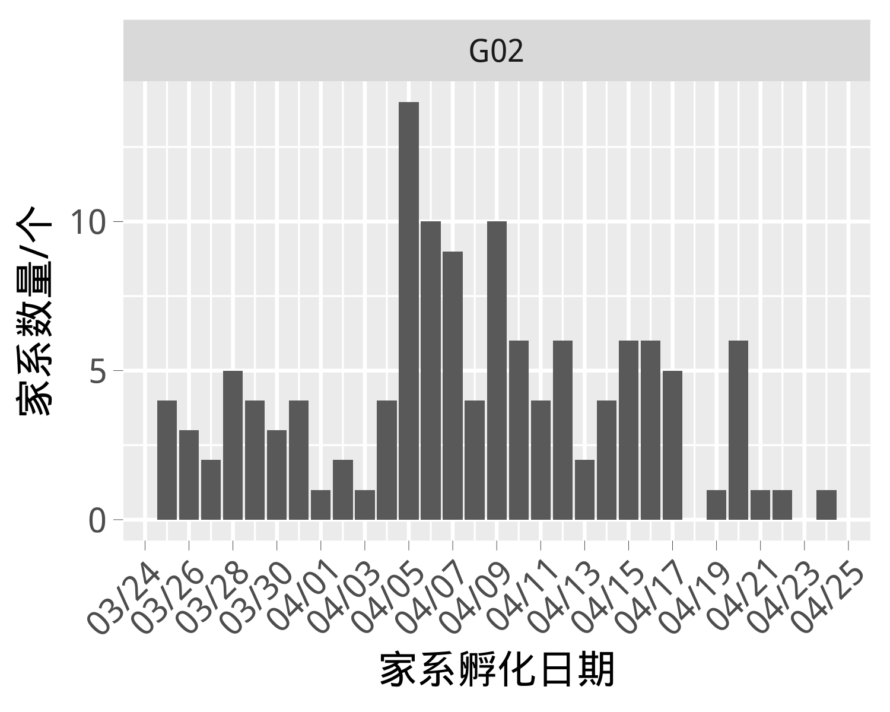<!-- -->

###### 图1 罗氏沼虾*Macrobrachium rosenbergii*育种群体2018G02世代家系生产同步性


#### 2.1.2.2 家系不同标准化阶段同步性

家系不同标准化阶段的同步性见表3。从孵化阶段到仔虾阶段平均天数为25.71d，从仔虾阶段到VIE标记阶段平均天数为59.07d，从孵化阶段到VIE标记阶段平均天数为82.78d。


Table: 表3 罗氏沼虾*Macrobrachium rosenbergii*育种群体2018G02世代家系不同标准化阶段天数

|         不同阶段          | 平均值/d | 最小值/d | 最大值/d |
|:-------------------------:|:--------:|:--------:|:--------:|
|  孵化阶段到仔虾阶段天数   |  25.71   |    22    |    31    |
| 仔虾阶段到VIE标记阶段天数 |  59.07   |    47    |    72    |
| 孵化阶段到VIE标记阶段天数 |  82.78   |    71    |    93    |


#### 2.1.2.3 家系不同标准化阶段存活率


罗氏沼虾*Macrobrachium rosenbergii*育种群体2018G02世代家系不同标准化阶段存活率见图2。其中，孵化到仔虾阶段的平均值为62.22%，最小值为23.60%，最大值为100.00%，标准差为15.04%，变异系数为24.17 %；仔虾到VIE标记阶段的平均值为83.05%，最小值为61.33%，最大值为100.00%，标准差为7.42%，变异系数为8.93 %。


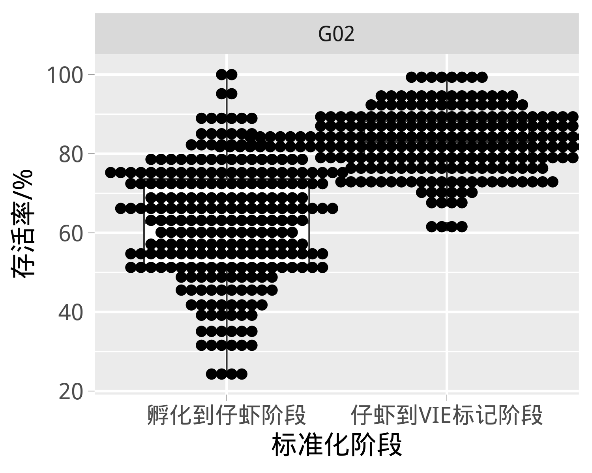<!-- -->

###### 图2 罗氏沼虾*Macrobrachium rosenbergii*育种群体2018G02世代家系不同标准化阶段存活率箱形图


#### 2.1.2.4 家系标记时体重与标记日龄的相关性

罗氏沼虾*Macrobrachium rosenbergii*育种群体2018G02世代家系标记时体重与标记日龄的散点图见图3，二者之间的相关系数为0.63±0.0489。

```
## `geom_smooth()` using formula 'y ~ x'
```

<!-- -->

###### 图3 罗氏沼虾*Macrobrachium rosenbergii*育种群体2018G02世代家系标记时体重与标记日龄的散点图


#### 2.1.2.5 家系标记时体重分布


罗氏沼虾*Macrobrachium rosenbergii*育种群体2018G02世代家系标记时体重见图4。其中，平均值为1.30g，最小值为0.76g，最大值为2.18g，标准差为0.22g，变异系数为16.56 %。

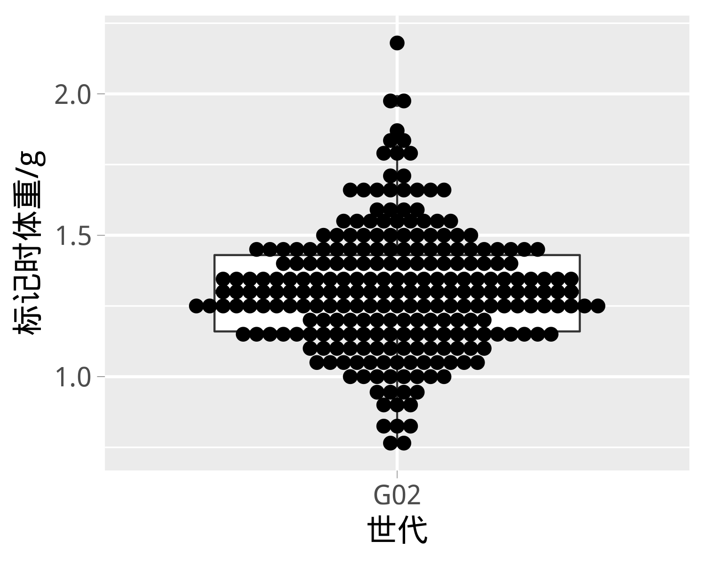<!-- -->

###### 图4 罗氏沼虾*Macrobrachium rosenbergii*育种群体2018G02世代家系标记时体重箱形图


## 2.2 育种群体的系谱分析  


等价完整世代数（the number of equivalent complete generations，equiGen）是评价系谱完整度的一个重要参数。它指的是个体已知的祖先个体，在可追溯的每个世代所占的比例之和。罗氏沼虾*Macrobrachium rosenbergii*育种群体2018G02世代家系个体的equiGen描述性统计参数如下所述。其中，平均值为2.92个，最小值为2.50个，最大值为3.00个，标准差为0.18个，变异系数为6.25 %。


系谱完整度指数（Index of pedigree completeness，PCI）是评价近交系数，估计育种值的一个重要参考指标。因为当个体的双亲有一个缺失时，其PCI指数就会为0，对于系谱缺失非常敏感。罗氏沼虾*Macrobrachium rosenbergii*育种群体2018G02世代家系个体的PCI描述统计参数如下所述。其中，平均值为0.97，最小值为0.80，最大值为1.00，标准差为0.07，变异系数为7.54 %。PCI越接近1，系谱越完整。


罗氏沼虾*Macrobrachium rosenbergii*育种群体2018G02世代家系双亲均可追溯世代数（包括双亲）（Number of fully traced generations,fullGen）的描述统计参数如下所述。其中，平均值为2.84个，最小值为2.00个，最大值为3.00个，标准差为0.36个，变异系数为12.84 %。


罗氏沼虾*Macrobrachium rosenbergii*育种群体2018G02世代家系最大可追溯世代数（Number of maximum generations traced,maxGen）的描述统计参数如下所述。其中，平均值为3.00个，最小值为3.00个，最大值为3.00个，标准差为0.00个，变异系数为0.00 %。


罗氏沼虾*Macrobrachium rosenbergii*育种群体2018G02世代家系的近交系数见图5。其中，平均值为0.0022，最小值为0.0000，最大值为0.0625，标准差为0.0105，变异系数为480.2885 %。


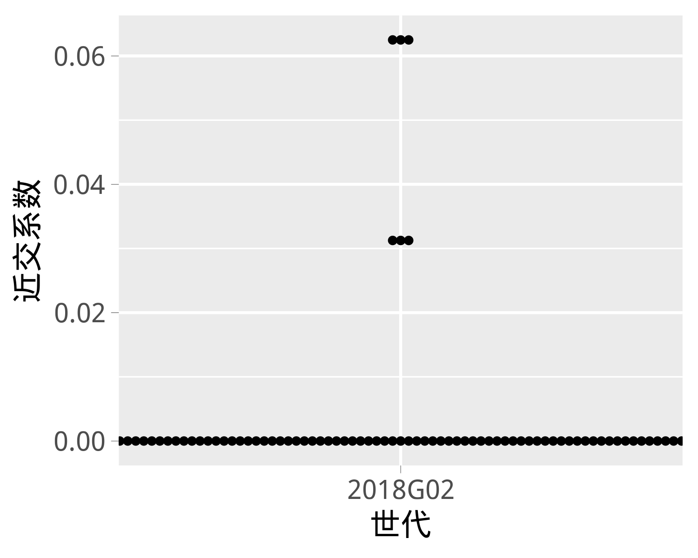<!-- -->

###### 图5 罗氏沼虾*Macrobrachium rosenbergii*育种群体2018G02世代家系的近交系数箱形图


罗氏沼虾*Macrobrachium rosenbergii*育种群体2018G02世代家系间的共亲系数见图6。家系间共亲系数的平均值为0.0087，最小值为0.0000，最大值为0.1875，标准差为0.0187，变异系数为214.3873 %。

<!-- -->

###### 图6 罗氏沼虾*Macrobrachium rosenbergii*育种群体2018G02世代家系间的共亲系数热图


罗氏沼虾*Macrobrachium rosenbergii*育种群体2018G02世代的遗传多样性为0.99,有效群体大小为
119.77。


罗氏沼虾*Macrobrachium rosenbergii*育种群体2018G02世代奠基者群体贡献的比例见图7。各奠基者群体贡献比例的平均值为14.29%，最小值为0.00%，最大值为40.51%，标准差为13.37%，变异系数为93.62 %。


<!-- -->

###### 图7 罗氏沼虾*Macrobrachium rosenbergii*育种群体2018G02世代奠基者群体贡献比例的堆积面积图


## 2.3 育种群体目标性状的描述性统计分析  


### 2.3.1 个体水平上的描述性统计参数\n

#### 2.3.1.1 收获体重(WT)性状


罗氏沼虾*Macrobrachium rosenbergii*育种群体2018G02世代个体收获体重(WT)性状观测值的描述性统计参数见表4。其中，测试个体总数为25059 尾，收获体重(WT)平均值为40.94 g，最小值为3.70 g，最大值为113.80 g，标准差为14.38 g，变异系数为35.13 %。


Table: 表4 罗氏沼虾*Macrobrachium rosenbergii*育种群体2018G02世代个体收获体重(WT)性状观测值描述性统计参数


|养殖模式 | 性别  | 数量/尾| 平均值/g| 最小值/g| 最大值/g| 标准差/g| 变异系数/%|
|:--------|:------|-------:|--------:|--------:|--------:|--------:|----------:|
|PD00     |Female |   13297|    34.48|      4.6|     69.7|     7.53|      21.84|
|PD00     |Male   |   11762|    48.25|      3.7|    113.8|    16.61|      34.43|
|NA       |NA     |   25059|    40.94|      3.7|    113.8|    14.38|      35.13|


罗氏沼虾*Macrobrachium rosenbergii*育种群体2018G02世代个体收获体重(WT)性状的箱形图分布见图8。


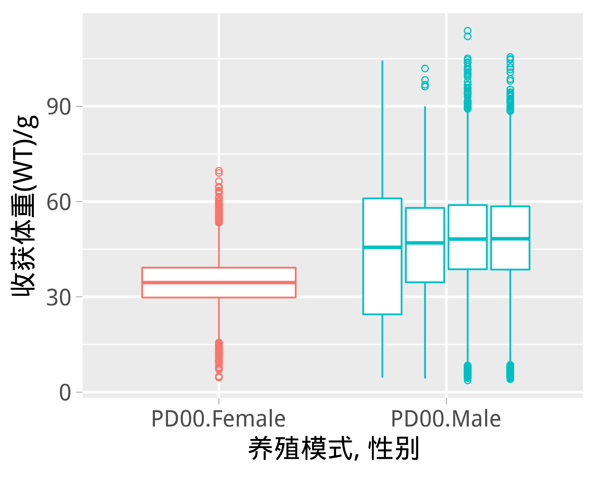<!-- -->

###### 图8 罗氏沼虾*Macrobrachium rosenbergii*育种群体2018G02世代个体收获体重(WT)性状的箱形图


#### 2.3.1.2 日增重(ADG)性状


罗氏沼虾*Macrobrachium rosenbergii*育种群体2018G02世代个体日增重(ADG)性状观测值的描述性统计参数见表5。其中，测试个体总数为25059 尾，日增重(ADG)平均值为0.39 g/d，最小值为0.02 g/d，最大值为1.14 g/d，标准差为0.14 g/d，变异系数为35.36 %。


Table: 表5 罗氏沼虾*Macrobrachium rosenbergii*育种群体2018G02世代个体日增重(ADG)性状观测值描述性统计参数


|养殖模式 | 性别  | 数量/尾| 平均值/g/d| 最小值/g/d| 最大值/g/d| 标准差/g/d| 变异系数/%|
|:--------|:------|-------:|----------:|----------:|----------:|----------:|----------:|
|PD00     |Female |   13297|       0.33|       0.03|       0.65|       0.07|      21.77|
|PD00     |Male   |   11762|       0.46|       0.02|       1.14|       0.16|      34.36|
|NA       |NA     |   25059|       0.39|       0.02|       1.14|       0.14|      35.36|


罗氏沼虾*Macrobrachium rosenbergii*育种群体2018G02世代个体日增重(ADG)性状的箱形图分布见图9。


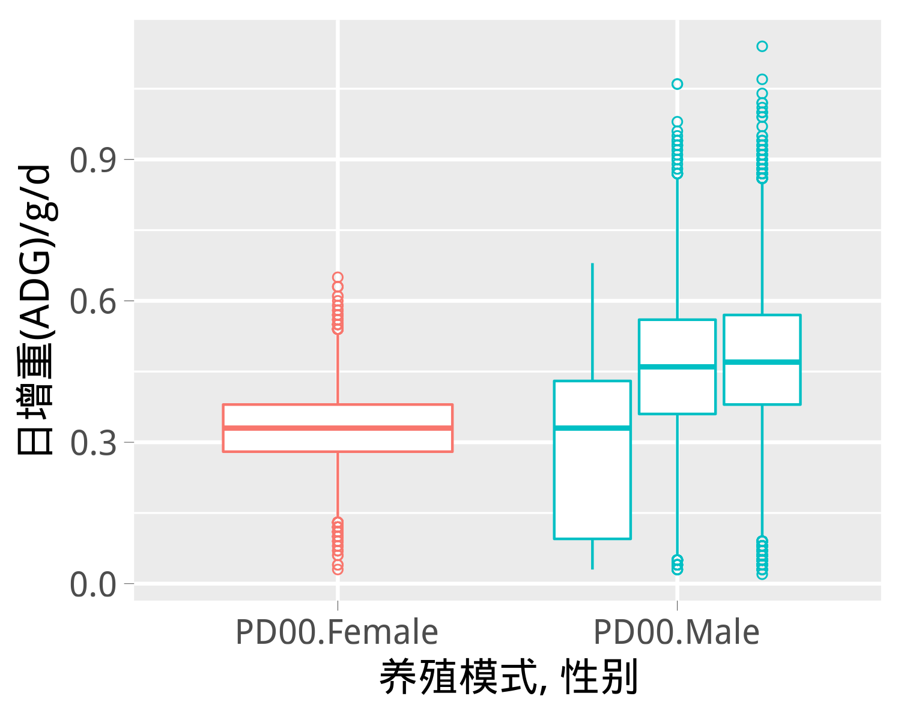<!-- -->

###### 图9 罗氏沼虾*Macrobrachium rosenbergii*育种群体2018G02世代个体日增重(ADG)性状的箱形图


### 2.3.2 家系水平上的描述性统计参数\n


#### 2.3.2.1 收获体重(WT)性状


罗氏沼虾*Macrobrachium rosenbergii*育种群体2018G02世代家系收获体重(WT)性状的描述性统计参数见表6。其中，基于家系的测试组数量为258 个，收获体重(WT)平均值为41.03 g，最小值为20.76 g，最大值为57.89 g，标准差为6.59 g，变异系数为16.05 %。


Table: 表6 罗氏沼虾*Macrobrachium rosenbergii*育种群体2018G02世代家系收获体重(WT)性状描述统计参数

|养殖模式 | 测试池 | 数量/个| 平均值/g| 最小值/g| 最大值/g| 标准差/g| 变异系数/%|
|:--------|:-------|-------:|--------:|--------:|--------:|--------:|----------:|
|PD00     |P10     |     129|    42.50|    22.08|    57.89|     7.02|      16.53|
|PD00     |P11     |     129|    39.56|    20.76|    52.08|     5.78|      14.62|
|NA       |NA      |     258|    41.03|    20.76|    57.89|     6.59|      16.05|


罗氏沼虾*Macrobrachium rosenbergii*育种群体2018G02世代家系收获体重(WT)性状的箱形图分布见图10。


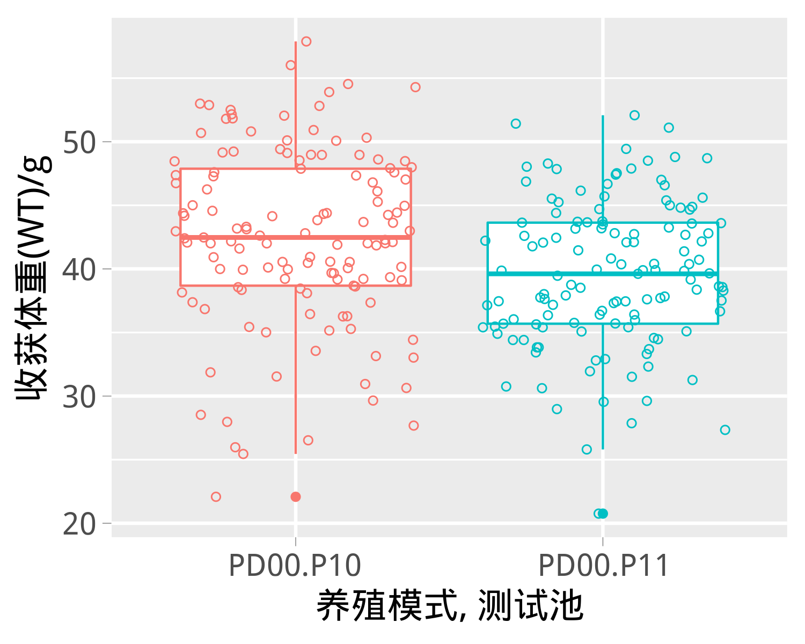<!-- -->

###### 图10 罗氏沼虾*Macrobrachium rosenbergii*育种群体2018G02世代家系收获体重(WT)性状的箱形图


罗氏沼虾*Macrobrachium rosenbergii*育种群体2018G02世代家系收获体重与标记时体重的散点图见图11，二者之间的相关系数为0.71±0.0626。

```
## `geom_smooth()` using formula 'y ~ x'
```

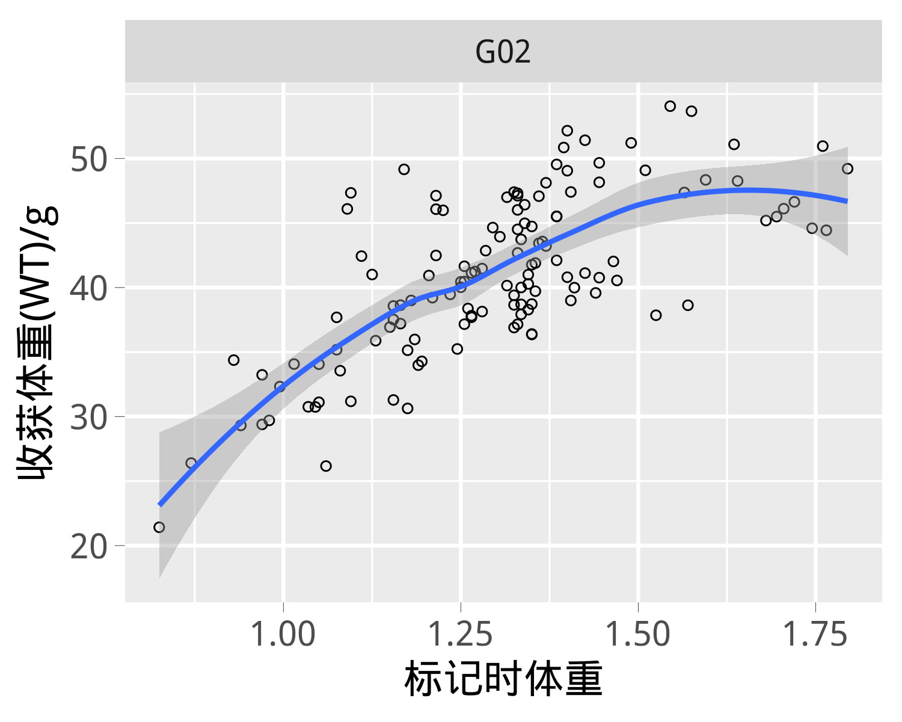<!-- -->

###### 图11 罗氏沼虾*Macrobrachium rosenbergii*育种群体2018G02世代家系收获体重与标记时体重的散点图


#### 2.3.2.2 日增重(ADG)性状


罗氏沼虾*Macrobrachium rosenbergii*育种群体2018G02世代家系日增重(ADG)性状的描述性统计参数见表7。其中，基于家系的测试组数量为258 个，日增重(ADG)平均值为0.39 g/d，最小值为0.20 g/d，最大值为0.52 g/d，标准差为0.06 g/d，变异系数为14.45 %。


Table: 表7 罗氏沼虾*Macrobrachium rosenbergii*育种群体2018G02世代家系日增重(ADG)性状描述统计参数

|养殖模式 | 测试池 | 数量/个| 平均值/g/d| 最小值/g/d| 最大值/g/d| 标准差/g/d| 变异系数/%|
|:--------|:-------|-------:|----------:|----------:|----------:|----------:|----------:|
|PD00     |P10     |     129|       0.38|       0.20|       0.50|       0.06|      15.25|
|PD00     |P11     |     129|       0.40|       0.22|       0.52|       0.05|      13.07|
|NA       |NA      |     258|       0.39|       0.20|       0.52|       0.06|      14.45|


罗氏沼虾*Macrobrachium rosenbergii*育种群体2018G02世代家系日增重(ADG)性状的箱形图分布见图12。


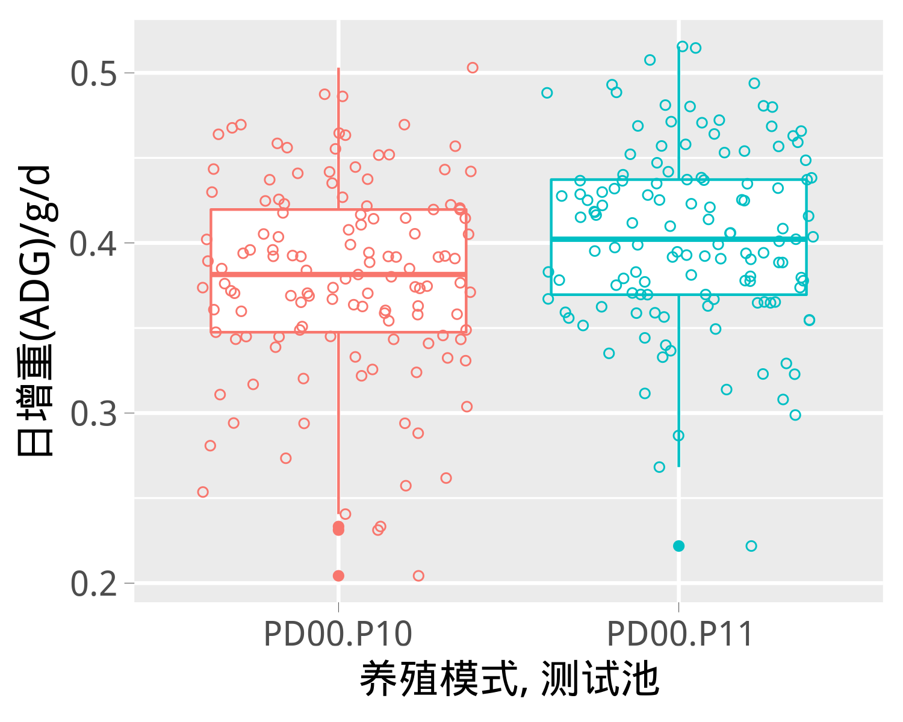<!-- -->

###### 图12 罗氏沼虾*Macrobrachium rosenbergii*育种群体2018G02世代家系日增重(ADG)性状的箱形图


罗氏沼虾*Macrobrachium rosenbergii*育种群体2018G02世代家系日增重与标记时体重的散点图见图13，二者之间的相关系数为0.67±0.0661。

```
## `geom_smooth()` using formula 'y ~ x'
```

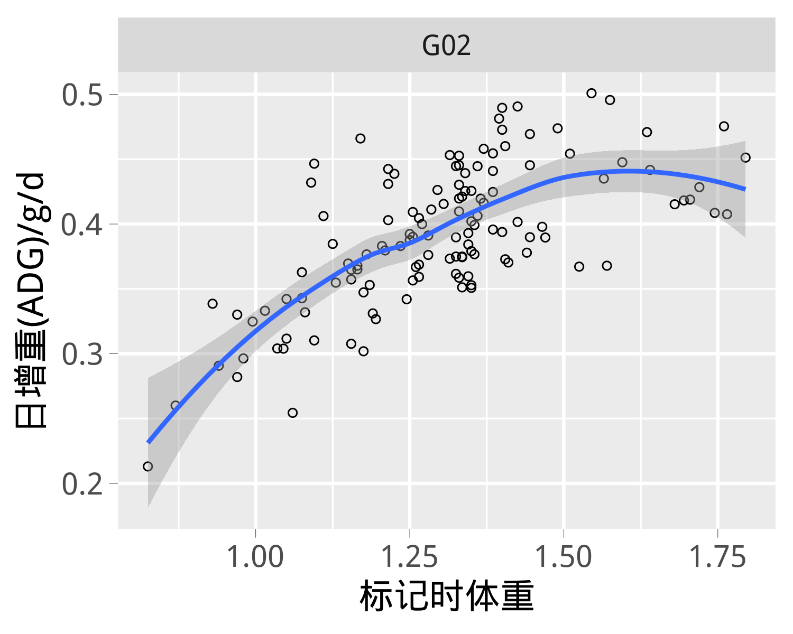<!-- -->

###### 图13 罗氏沼虾*Macrobrachium rosenbergii*育种群体2018G02世代家系日增重与标记时体重的散点图


#### 2.3.2.3 存活(SUR)性状


罗氏沼虾*Macrobrachium rosenbergii*育种群体2018G02世代家系存活(SUR)性状的描述性统计参数见表8。其中，基于家系的测试组数量为258 个，存活(SUR)平均值为64.75 %，最小值为29.33 %，最大值为94.67 %，标准差为9.71 %，变异系数为14.99 %。


Table: 表8 罗氏沼虾*Macrobrachium rosenbergii*育种群体2018G02世代家系存活(SUR)性状描述统计参数

|养殖模式 | 测试池 | 数量/个| 平均值/%| 最小值/%| 最大值/%| 标准差/%| 变异系数/%|
|:--------|:-------|-------:|--------:|--------:|--------:|--------:|----------:|
|PD00     |P10     |     129|    61.68|    29.33|    94.67|     9.45|      15.32|
|PD00     |P11     |     129|    67.82|    29.33|    90.67|     8.99|      13.26|
|NA       |NA      |     258|    64.75|    29.33|    94.67|     9.71|      14.99|


罗氏沼虾*Macrobrachium rosenbergii*育种群体2018G02世代家系存活(SUR)性状的箱形图分布见图14。


<!-- -->

###### 图14 罗氏沼虾*Macrobrachium rosenbergii*育种群体2018G02世代家系存活(SUR)性状的箱形图


罗氏沼虾*Macrobrachium rosenbergii*育种群体2018G02世代家系存活与标记时体重的散点图见图15，二者之间的相关系数为-0.04±0.0887。

```
## `geom_smooth()` using formula 'y ~ x'
```

<!-- -->

###### 图15 罗氏沼虾*Macrobrachium rosenbergii*育种群体2018G02世代家系存活与标记时体重的散点图

## 2.4 育种群体目标性状的遗传参数估计  


### 2.4.1 收获体重(WT)性状


 收获体重 ( WT )性状的育种分析模型为： 

$$y_{ijklmn}=\mu+Gen_{i}+Sex_{j}+Sex_{j}*SS_{k}+Gen_{i}*Sex_{j}*SS_{k}+Gen_{i}*Tank_{l}+Gen_{i}*Sex_{j}*SS_{k}*Tank_{l}+Age_{m}(Gen_{i}*Sex_{j}*SS_{k}*Tank_{l})+a_{m}+c_{n}+e_{ijklmn}$$其中$y_{ijklmn}$表示第m尾个体的收获体重，$\mu$表示总体均值，$Gen_{i}$表示第i个世代(G00、G01)固定效应，$Sex_{j}$表示第j个性别（雌、雄）固定效应，$Sex_{j}*SS_{k}$表示第j个性别与第k个性别特征（雌虾：是否抱卵；雄虾：有无大鳌）交互的固定效应，$Gen_{i}*Sex_{j}*SS_{k}$表示第i世代、第j个性别与第k个性别特征（雌虾：是否抱卵；雄虾：有无大鳌）交互的固定效应，$Gen_{i}*Tank_{l}$表示第i世代与第l个测试池交互的固定效应，$Gen_{i}*Sex_{j}*SS_{k}*Tank_{l}$表示第i世代、第j个性别、第k个性别特征（雌虾：是否抱卵；雄虾：有无大鳌）与第l个测试池交互的固定效应，$Age_{m}(Gen_{i}*Tank_{l}*Sex_{j}*SS_{k})$表示嵌套在第i世代、第j个性别、第k个性别特征（雌虾：是否抱卵；雄虾：有无大鳌）与第l个测试池交互固定效应内的第m尾个体的日龄协变量，$a_{m}$表示第m尾个体的加性遗传效应（随机效应），$c_{k}$表示第k个全同胞家系的共同环境效应（随机效应），$e_{ijkm}$表示第m尾个体的随机残差。

 收获体重 ( WT )性状的遗传力计算公式： 

$$h^{2}=\frac{\sigma _{a}^{2}}{\sigma _{a}^{2}+\sigma _{c}^{2}+\sigma _{e}^{2}}$$其中$h^{2}$表示收获体重性状的遗传力，$\sigma _{a}^{2}$表示加性遗传方差，$\sigma _{c}^{2}$表示共同环境方差，$\sigma _{e}^{2}$表示残差方差。

###### 表9 罗氏沼虾*Macrobrachium rosenbergii*育种群体2018G02世代收获体重 ( WT )性状遗传参数


性状 | 表型方差$\sigma_{p}^{2}$  | 加性遗传方差$\sigma_{a}^{2}$   | 共同环境方差$\sigma_{c}^{2}$ | 残差方差$\sigma_{a}^{2}$ | 遗传力$h^{2}$ | 共同环境系数$c^{2}$ |
---- | -------------------------- | ------------------------------  | ----------------------------- | ------------------------- | ------------- | ------------------- |
 WT  |  108.08±1.64               | 22.74±3.78                      | 3.52±0.85                     | 81.82±1.98                |  0.21±0.03    | 0.03±0.01           |


### 2.4.3 存活(SUR)性状


 存活 ( SUR )性状的育种分析模型为： 

$$Pr(y_{ilmnoq}=1)=Pr(\eta_{ilmnoq}>0)=\Phi(\mu+Gen_{i}+Tank_{l}+Gen_{i}*Tank_{l}+s_{o}+d_{q}+c_{n})$$其中$y_{ilmnoq}$表示第m尾个体的存活性能(0:死亡;1:存活)，$\eta_{ilmnoq}$表示潜在变量，如果$\eta_{ilmnoq}$>0那么$y_{ilmnoq}$=1，如果$\eta_{ilmnoq}$≤0那么$y_{ilmnoq}$=0，$\mu$表示总体均值，$Gen_{i}$表示第i个世代固定效应，$Tank_{l}$表示第l个测试池固定效应，$Gen_{i}*Tank_{l}$表示第i世代与第l个测试池的固定效应，$s_{o}$表示第o尾父本的加性遗传效应，$d_{q}$表示第m尾母本的加性遗传效应。

 存活 ( SUR )性状的遗传力计算公式： 

$$h^{2}=\frac{4\sigma _{sd}^{2}}{2\sigma _{sd}^{2}+\sigma _{c}^{2}+\sigma _{e}^{2}}$$其中$h^{2}$表示日增重性状的遗传力，$\sigma _{sd}^{2}$表示父母本加性遗传方差均值，$\sigma _{c}^{2}$表示共同环境方差，$\sigma _{e}^{2}$表示残差方差。

###### 表10 罗氏沼虾*Macrobrachium rosenbergii*育种群体2018G02世代存活 ( SUR )性状遗传参数


性状 | 表型方差$\sigma_{p}^{2}$  | 加性遗传方差$4\sigma_{sd}^{2}$ | 共同环境方差$\sigma_{c}^{2}$ | 残差方差$\sigma_{a}^{2}$ | 遗传力$h^{2}$ | 转换后遗传力$h_{b}^{2}$ | 共同环境系数$c^{2}$ |
---- | -------------------------- | ------------------------------- | ----------------------------- | ------------------------- | ------------- | ---------------------   | ------------------- |
SUR  | 1.08±0.01                  | 0.08±0.024                      | 0.04±0.01                     | 1±0.00                    | 0.07±0.02     | 0.04±0.01               | 0.04±0.01           |


<!-- ## 2.5 育种群体目标性状的育种值预测 -->
<!-- ```{r trait.ebv.prediction,results="asis",child="Results/ebvTrait.Rmd"} -->
<!-- ``` -->

## 2.6 育种群体目标性状的遗传进展分析  


### 2.6.1 实现遗传进展

#### 收获体重(WT)性状


###### 表11 罗氏沼虾*Macrobrachium rosenbergii*育种群体2018G02世代收获体重 ( WT )性状的实现选择反应


世代           | 群体        | 家系数量  | 个体数量 | 最小二乘均值 | 遗传增益 | 百分比（%） |
-------------- | ----------- | --------- | -------- | ------------- | -------- | ----------- |
2017G01(2016)  | 选择组      | 105       | 14845    | 33.93         |  4.87    | 16.76       |
2017G01(2016)  | 对照组      | 15        | 2006     | 29.06         |  /       |  /          |
2018G02(2016)  | 选择组      | 114       | 22180    | 41.51         |  4.06    | 11.02       |
2018G02(2016)  | 对照组      | 15        | 2879     | 37.39         |  /       |  /          |


#### 日增重(ADG)性状


未执行该项分析。


#### 存活(SUR)性状


未执行该项分析。


### 2.6.2 预测遗传进展

#### 收获体重(WT)性状


###### 表12 罗氏沼虾*Macrobrachium rosenbergii*育种群体2018G02世代收获体重 ( WT )性状的预测选择反应


世代           | 家系数量   | 个体数量 | 育种值（g） | 遗传增益（g） | 百分比（%）       |
-------------- | ---------- | -------- | ------------| ------------- | ----------------- |
2016G00(2016)  | 78         | 8361     |  0.3589     |  /            |  /              |
2017G01(2016)  | 120        | 16851    |  3.5702     |  3.21         | 8.59-11.05       |
2018G02(2016)  | 129        | 25059    |  6.3436     |  2.77         | 7.41-9.53       |


#### 日增重(ADG)性状


未执行该项分析。


#### 存活(SUR)性状


未执行该项分析。


## 2.7 育种群体目标性状选择指数和家系性能  


### 2.7.1 个体水平上的选择指数分析


#### 2.7.1. 1   收获体重 ( WT )

罗氏沼虾*Macrobrachium rosenbergii*育种群体2018G02世代个体选择指数与收获体重 ( WT )性状育种值的散点图分布见图16，二者之间的相关系数为0.88±0.0030。

```
## `geom_smooth()` using formula 'y ~ s(x, bs = "cs")'
```

<!-- -->

###### 图16 罗氏沼虾*Macrobrachium rosenbergii*育种群体2018G02世代个体选择指数与收获体重 ( WT )性状育种值的散点图分布


### 2.7.2 家系水平上的选择指数分析


#### 2.7.2. 1   收获体重 ( WT )

罗氏沼虾*Macrobrachium rosenbergii*育种群体2018G02世代家系选择指数与收获体重 ( WT )性状育种值的散点图分布见图17，二者之间的相关系数为0.82±0.0355。

```
## `geom_smooth()` using formula 'y ~ x'
```

<!-- -->

###### 图17 罗氏沼虾*Macrobrachium rosenbergii*育种群体2018G02世代家系选择指数与收获体重 ( WT )性状育种值的散点图


#### 2.7.2. 3   存活 ( SUR )

罗氏沼虾*Macrobrachium rosenbergii*育种群体2018G02世代家系选择指数与存活 ( SUR )性状育种值的散点图分布见图18，二者之间的相关系数为0.23±0.0608。

```
## `geom_smooth()` using formula 'y ~ x'
```

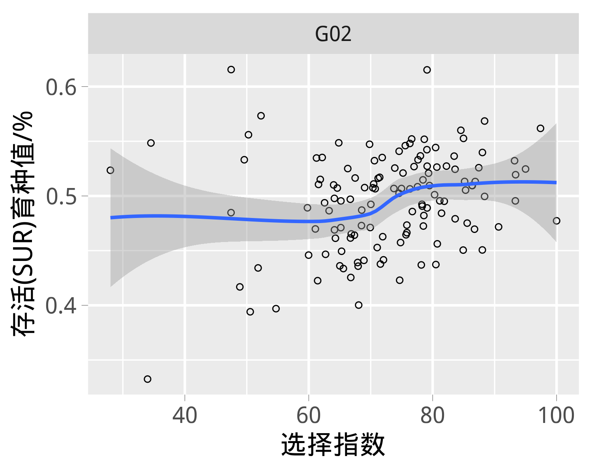<!-- -->

###### 图18 罗氏沼虾*Macrobrachium rosenbergii*育种群体2018G02世代家系选择指数与存活 ( SUR )性状育种值的散点图


### 2.7.3 育种群体家系育种目标性状的综合选择指数


罗氏沼虾*Macrobrachium rosenbergii*育种群体2018G02世代各家系选择指数见图19。

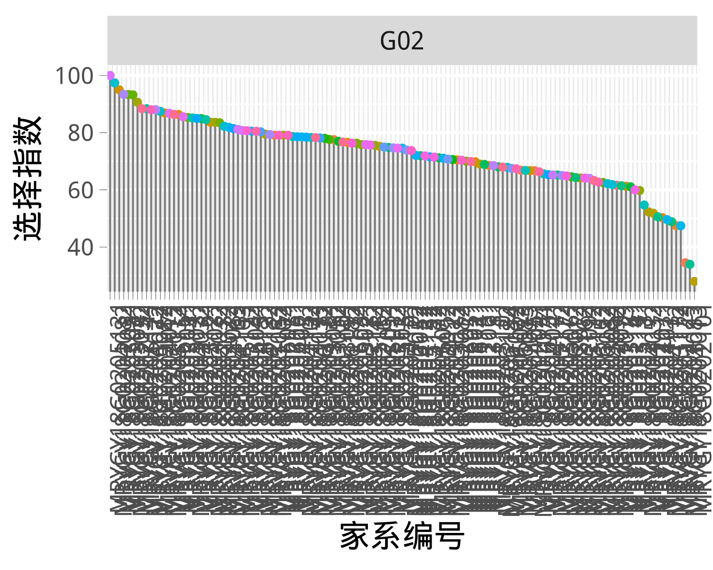<!-- -->

###### 图19 罗氏沼虾*Macrobrachium rosenbergii*育种群体2018G02世代各家系选择指数
### 2.7.4 留种和配种方案制定原则
为了更好地控制近亲交配，最大限度地提高目标性状的遗传进展，利用遗传贡献理论，选择优秀的家系和个体制定配种方案。在新的方案下，参与配种的家系数量可能会多于或少于一半家系，因此不再预留一半家系。

请根据选择指数制定方法、以及配种过程进行补充。

#####
# 三、讨论  

## 2019年工作建议：
1）家系亲本的SNP分型。由于在2019年家系构建中，引入了扩繁群体，因此需要明确他们跟核心群之间的亲缘关系。而且从2018年家系的SNP分型结果来看，分型信息对于提高遗传评估的准确度，还是很有帮助的。
2）2018年性状测试和亲虾越冬的存活率都比较高。当前性状测试，放苗规格在1.39g，放苗密度在10尾/平方米。这个密度是否已接近生产密度，如有进一步提高的空间，建议在不影响存活率和生长速度的前提下，放苗密度继续增加至15尾/平方米。
3）收获进行性状测量时，大鳌颜色进一步细分为蓝色、橙色、老头虾蓝色和小虾。
4）抗逆性状。生产上反馈，在10度水温仍然可以存活。着重考虑耐低温性状，可以设置性状测试实验，评估耐低温的能力，作为培育新品种的一个目标性状。
5）雌雄群体收获体重的遗传参数对比测试。主要是考虑分析雄虾个体间的社会交互行为，是否对遗传参数估计有很大影响。尽量选择半同胞家系60个,设置雄虾和雌虾两个处理组。每个处理组设置2个平行，每个平行每个家系标记30尾。每个处理，每个平行标记1800尾虾。共计需要标记7200尾虾，大约需要720平米的面积，大约是200平方米的网箱4个。


 
